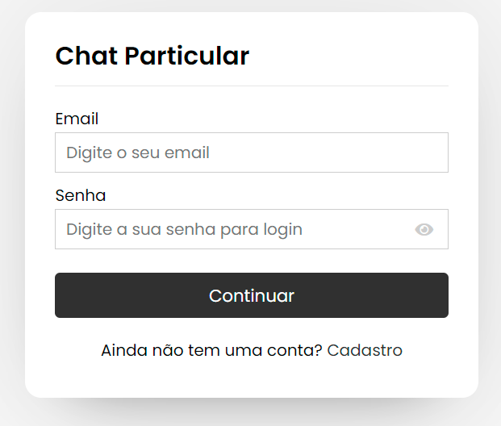
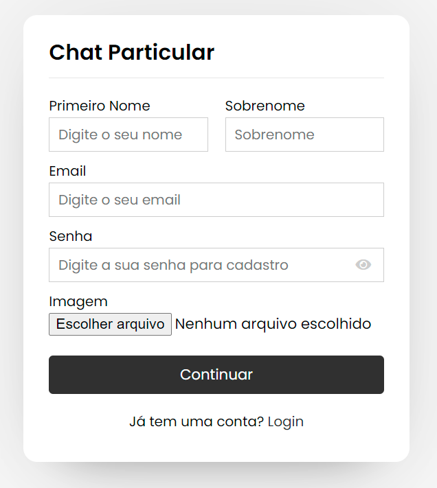
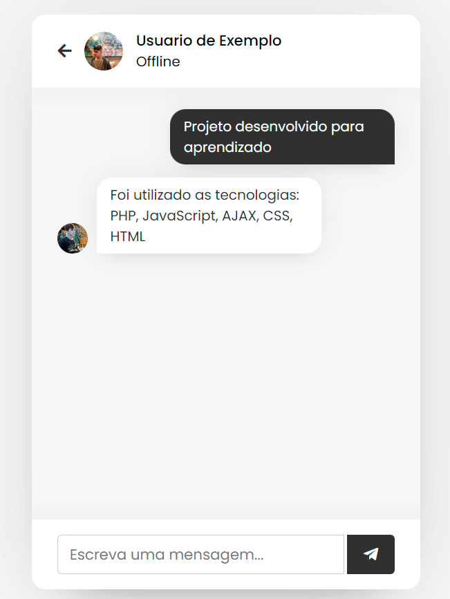
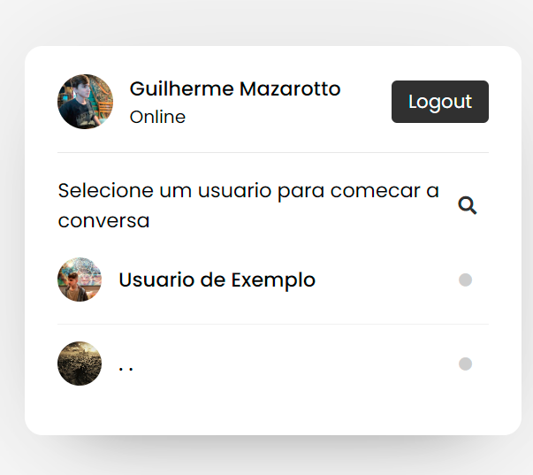

# Projeto Chat Live
> Aperte em :star: se gostou do projeto. Pull Request são muito bem vistos

Este projeto foi realizado durante meus estudos em PHP, e durante o desenvolvimento dele aprendi diversos funcionamentos para me aperfeiçoar no PHP como por exemplo:
  - Aprendi a usar cookies do navegador para armazenar variaveis do PHP
  - Utilizar o AJAX para que o cadastro das mensagens seja realizado sem recarregar a pagina
  - Fazer a importação de imagens e cadastralas no banco de dados
  - E entre outros recursos

Segue alguns screenshots da aplicação funcionando. Para baixar ela no seu dispositivo, é necessário fazer a importação da base de dados o arquivo SQL esta localizado na raiz do projeto, alem disso é preciso configurar o arquivo /PHP/config.php para se conectar com sua base de dados local

  

